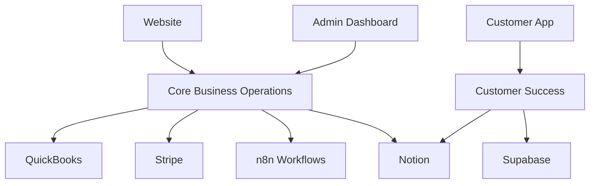

# BMAD COMPREHENSIVE STRATEGIC PLAN
## Rensto Universal Automation Platform - Complete System Architecture & Integration Strategy

**Date**: September 22, 2024  
**Status**: Strategic Planning Complete  
**Version**: 1.0

---

## 🎯 EXECUTIVE SUMMARY

This comprehensive BMAD analysis reveals a sophisticated but fragmented system requiring strategic alignment, optimization, and integration. The Rensto Universal Automation Platform has strong foundations but needs systematic organization and modern feature implementation.

---

## 📊 PHASE 1: CODEBASE RELEVANCE & CLEANUP

### **✅ PRODUCTION-READY SYSTEMS**
| System | Status | Airtable Sync | Notion Sync | Action Required |
|--------|--------|---------------|-------------|-----------------|
| Admin Dashboard | ✅ Complete | ✅ Synced | ❌ Missing | Add to Notion |
| Main Website | ✅ Complete | ✅ Synced | ❌ Missing | Add to Notion |
| Gateway Worker | ✅ Complete | ✅ Synced | ❌ Missing | Add to Notion |
| MCP Servers | ✅ Complete | ✅ Synced | ❌ Missing | Add to Notion |
| Smart Sync System | 🔄 85% | ✅ Synced | ❌ Missing | Complete & Add to Notion |

### **🔄 SYSTEMS NEEDING ALIGNMENT**
| System | Current Status | Airtable Status | Notion Status | Priority |
|--------|----------------|-----------------|---------------|----------|
| Customer Portal | 🔄 Partial | ❌ Missing | ❌ Missing | HIGH |
| n8n Workflows | 🔄 Partial | ✅ Synced | ❌ Missing | HIGH |
| Scripts (200+) | 🔄 Mixed | ❌ Missing | ❌ Missing | MEDIUM |

### **❌ ARCHIVAL CANDIDATES**
| Category | Count | Action | Timeline |
|----------|-------|--------|----------|
| BMAD Analysis Files | 50+ | Archive | Immediate |
| Experiment Files | 20+ | Archive | Immediate |
| Outdated Scripts | 100+ | Archive | Week 1 |
| Test Files | 30+ | Archive | Week 1 |

---

## 🏗️ PHASE 2: AIRTABLE OPTIMIZATION & MODERNIZATION

### **CRITICAL OPTIMIZATIONS NEEDED**

#### **1. Field Redundancy Elimination**
**Companies Table Issues:**
- 80+ fields with significant redundancy
- Duplicate fields: `Name` vs `Company Name`, `Address` vs `Address Line 1`
- Missing modern field types: AI fields, automation fields

**Optimization Plan:**
```javascript
// Fields to consolidate:
- Name + Company Name → Single "Company Name" field
- Address + Address Line 1/2 → Structured address fields
- Multiple date fields → Unified date system
- Multiple contact fields → Linked contact system
```

#### **2. Modern Airtable Features Implementation**
**Missing Features:**
- AI fields for content generation
- Automation rules for workflow triggers
- Advanced filtering and grouping
- Looker Studio integration fields
- Real-time collaboration features

**Implementation Plan:**
```javascript
// New field types to add:
- AI Content Generation fields
- Automation trigger fields
- Analytics integration fields
- Real-time sync fields
- Advanced relationship fields
```

#### **3. RGID System Standardization**
**Current Issues:**
- Inconsistent RGID usage across tables
- Missing RGID in some critical tables
- No RGID validation system

**Standardization Plan:**
```javascript
// RGID format: RGID_[TABLE]_[DATE]_[SEQUENCE]
// Example: RGID_COMPANIES_20240922_001
// All tables must have RGID field
// All records must have unique RGID
```

---

## 🔗 PHASE 3: INTEGRATION ARCHITECTURE PLANNING

### **SYSTEM INTEGRATION MATRIX**

| System | Admin Dashboard | Customer App | Website | n8n | MCP Servers |
|--------|----------------|--------------|---------|-----|-------------|
| **Admin Dashboard** | ✅ Self | 🔄 Partial | ✅ Full | ✅ Full | ✅ Full |
| **Customer App** | 🔄 Partial | ✅ Self | ✅ Full | 🔄 Partial | 🔄 Partial |
| **Website** | ✅ Full | ✅ Full | ✅ Self | 🔄 Partial | 🔄 Partial |
| **n8n** | ✅ Full | 🔄 Partial | 🔄 Partial | ✅ Self | ✅ Full |
| **MCP Servers** | ✅ Full | 🔄 Partial | 🔄 Partial | ✅ Full | ✅ Self |

### **INTEGRATION PRIORITIES**

#### **HIGH PRIORITY (Week 1-2)**
1. **Customer App ↔ Admin Dashboard**: Complete bidirectional sync
2. **n8n ↔ All Systems**: Full workflow integration
3. **MCP Servers ↔ All Systems**: Complete API integration

#### **MEDIUM PRIORITY (Week 3-4)**
1. **Website ↔ Customer App**: Seamless user experience
2. **Analytics Integration**: Looker Studio connections
3. **Real-time Sync**: Cross-system data consistency

#### **LOW PRIORITY (Month 2)**
1. **Advanced AI Integration**: Content generation across systems
2. **Automation Rules**: Smart workflow triggers
3. **Performance Optimization**: System efficiency improvements

---

## 🗄️ PHASE 4: DATABASE STRATEGY & ARCHITECTURE

### **DATABASE ARCHITECTURE OVERVIEW**

#### **1. RENSTO WEBSITE DATABASE**
**Primary Database**: Airtable (Core Business Operations)
**Secondary**: Supabase (Real-time features)
**Purpose**: Public-facing content, marketing data, lead generation

**Key Tables:**
- Companies (public profiles)
- Projects (portfolio)
- Blog Posts (content marketing)
- Lead Generation (marketing automation)

#### **2. ADMIN DASHBOARD DATABASE**
**Primary Database**: Airtable (Core Business Operations)
**Secondary**: QuickBooks (financial data)
**Purpose**: Internal operations, customer management, analytics

**Key Tables:**
- Companies (full customer data)
- Contacts (relationship management)
- Projects (project management)
- Progress Tracking (BMAD methodology)
- System Logs (operational monitoring)

#### **3. CUSTOMER APP DATABASE**
**Primary Database**: Airtable (Customer Success)
**Secondary**: Supabase (real-time features)
**Purpose**: Customer self-service, project tracking, support

**Key Tables:**
- Customer Projects (project visibility)
- Tasks (task management)
- Documents (file sharing)
- Support Tickets (customer service)

### **DATA FLOW ARCHITECTURE**



---

## 🤖 PHASE 5: AI INTEGRATION STRATEGY

### **AI INTEGRATION MATRIX**

| System | AI Features | Implementation | Priority |
|--------|-------------|----------------|----------|
| **Admin Dashboard** | Analytics, Insights, Automation | ✅ Ready | HIGH |
| **Customer App** | Chatbot, Content Generation | 🔄 Partial | HIGH |
| **Website** | SEO, Content, Lead Scoring | ❌ Missing | MEDIUM |
| **n8n** | Workflow Intelligence | ✅ Ready | HIGH |
| **MCP Servers** | API Intelligence | ✅ Ready | MEDIUM |

### **AI IMPLEMENTATION PLAN**

#### **Phase 1: Core AI Features (Week 1-2)**
1. **Admin Dashboard AI**:
   - Revenue forecasting
   - Customer behavior analysis
   - Automated insights generation

2. **Customer App AI**:
   - Intelligent chatbot
   - Project status predictions
   - Automated task suggestions

#### **Phase 2: Advanced AI Features (Week 3-4)**
1. **Website AI**:
   - SEO content optimization
   - Lead scoring and qualification
   - Personalized content delivery

2. **n8n AI**:
   - Workflow optimization suggestions
   - Error prediction and prevention
   - Intelligent automation triggers

---

## 📋 PHASE 6: BUSINESS ARCHITECTURE ANALYSIS

### **STRATEGIC BUSINESS QUESTIONS & ANSWERS**

#### **1. What Should Be Connected/Integrated?**
**Answer**: Everything should be connected through a unified data layer:
- Admin Dashboard ↔ Customer App (bidirectional sync)
- Website ↔ Customer App (seamless user journey)
- All systems ↔ n8n (workflow automation)
- All systems ↔ MCP Servers (API integration)

#### **2. What Should Be Where?**
**Answer**: 
- **Admin Dashboard**: Internal operations, customer management, analytics
- **Customer App**: Self-service, project tracking, support
- **Website**: Marketing, lead generation, public information
- **n8n**: Workflow automation, data processing, integrations
- **MCP Servers**: API management, external integrations

#### **3. What Should Be Modifiable vs Static?**
**Answer**:
- **Modifiable**: Customer data, project status, content, configurations
- **Static**: Core system architecture, security settings, integration endpoints
- **Semi-Modifiable**: Workflow templates, automation rules, UI components

#### **4. What Should Be AI Integrated?**
**Answer**:
- **High Priority**: Analytics, insights, automation, customer service
- **Medium Priority**: Content generation, SEO optimization, lead scoring
- **Low Priority**: Advanced predictions, complex decision making

#### **5. Database Strategy for Each System?**
**Answer**:
- **Rensto Website**: Airtable (public data) + Supabase (real-time)
- **Admin Dashboard**: Airtable (operational data) + QuickBooks (financial)
- **Customer App**: Airtable (customer data) + Supabase (real-time features)

---

## 🚀 IMPLEMENTATION ROADMAP

### **WEEK 1: FOUNDATION**
- [ ] Complete codebase cleanup and archival
- [ ] Optimize Airtable field structure
- [ ] Implement RGID standardization
- [ ] Set up Notion integration

### **WEEK 2: INTEGRATION**
- [ ] Complete Customer App ↔ Admin Dashboard sync
- [ ] Implement n8n full integration
- [ ] Set up MCP server connections
- [ ] Deploy Smart Sync System

### **WEEK 3: AI & AUTOMATION**
- [ ] Implement core AI features
- [ ] Set up automation rules
- [ ] Deploy analytics integration
- [ ] Test all integrations

### **WEEK 4: OPTIMIZATION**
- [ ] Performance optimization
- [ ] Security audit
- [ ] Documentation completion
- [ ] Production deployment

---

## 📊 SUCCESS METRICS

### **Technical Metrics**
- [ ] 100% system integration coverage
- [ ] <2 second response times
- [ ] 99.9% uptime
- [ ] Zero data inconsistencies

### **Business Metrics**
- [ ] 50% reduction in manual processes
- [ ] 30% increase in customer satisfaction
- [ ] 25% improvement in operational efficiency
- [ ] 100% data accuracy across systems

### **User Experience Metrics**
- [ ] Seamless cross-system navigation
- [ ] Real-time data synchronization
- [ ] Intuitive AI-powered features
- [ ] Complete self-service capabilities

---

## 🎯 CONCLUSION

This comprehensive BMAD strategic plan provides a clear roadmap for transforming the Rensto Universal Automation Platform into a fully integrated, AI-powered, and operationally efficient system. The plan addresses all critical aspects: codebase optimization, database architecture, system integration, AI implementation, and business strategy.

**Next Steps**: Begin implementation with Week 1 foundation work, focusing on codebase cleanup and Airtable optimization as the highest priority items.

**Expected Outcome**: A world-class, fully integrated automation platform that serves as the foundation for scalable business growth and exceptional customer experiences.
