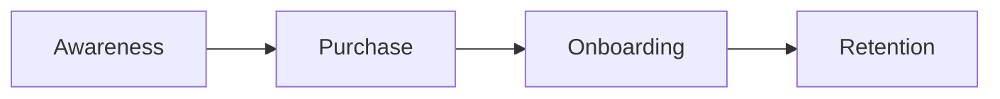

# 🛤️ Customer Journey

> **Source of Truth for how customers move through the Rensto funnel.**

---

## The 4 Stages

---

## Stage 1: Awareness → Purchase
- **Channels**: SEO, Social Media, Referrals.
- **Landing Pages**: `/marketplace`, `/offers`, niche pages (`/hvac`, `/realtor`).
- **Conversion**: Stripe Checkout.

---

## Stage 2: Purchase → Onboarding
- **Trigger**: Stripe webhook `checkout.session.completed`.
- **Actions**: Firestore lead created, n8n notification, email sent.
- **Time to First Value**: Target < 24 hours.

---

## Stage 3: Onboarding → Active Customer
- **Portal**: User accesses dashboard for project status, downloads, support.
- **Touchpoints**: Welcome email, setup guide, first check-in.

---

## Stage 4: Active → Retention
- **Engagement**: Regular check-ins, upsells, feature announcements.
- **Churn Triggers**: No portal logins in 60 days, no lead exports in 14 days.

---

## Key Metrics

| Metric | Target |
| :--- | :--- |
| Onboarding Completion Rate | 90%+ |
| Customer Retention Rate | 85%+ |
| Upsell Rate | 20%+ |
| Customer Lifetime Value (LTV) | $3,000-$8,000 |
