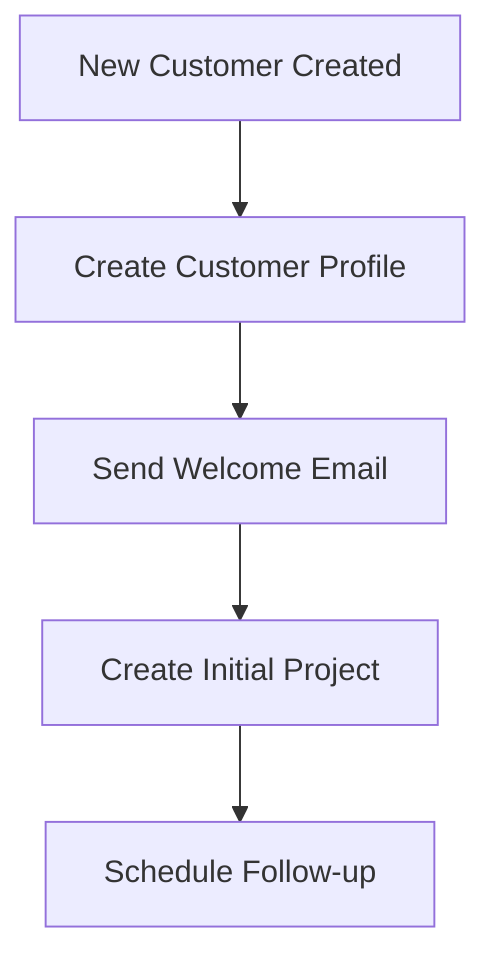
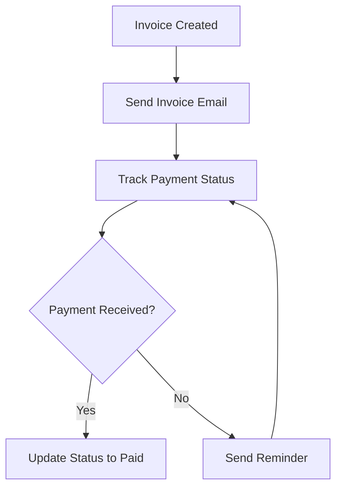
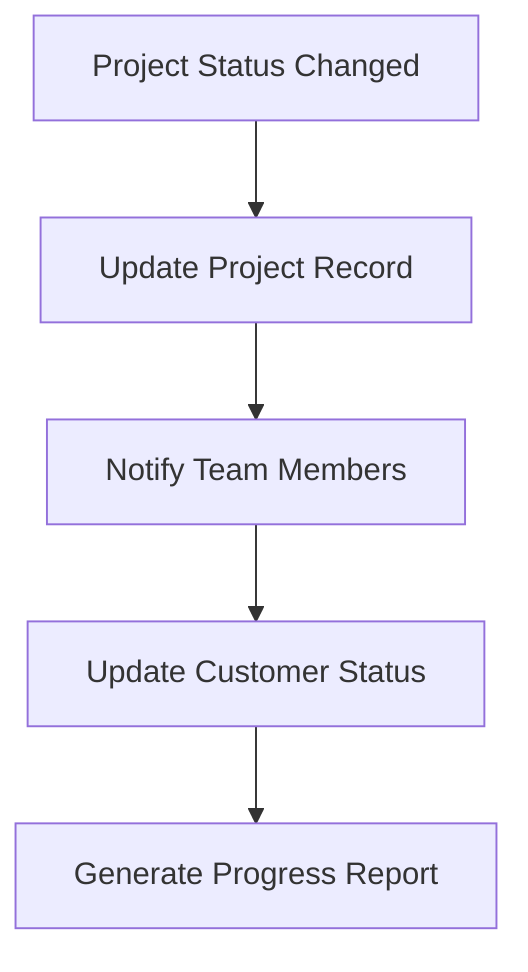

# 🚀 **AIRTABLE MIGRATION STRATEGY - COMPREHENSIVE PLAN**

## 📊 **EXECUTIVE SUMMARY**

**Date**: August 25, 2025  
**Status**: 🔄 **MIGRATION IN PROGRESS**  
**Strategy**: Replace Boost.space with Airtable + MCP Server  
**API Key**: `patTR4PhdTjz2fUrg.4bb86ab39b6eda124af3e5a897c215b5113e80e63ccd70b64382027cc71a8e12`  

---

## 🎯 **MIGRATION RATIONALE**

### **❌ Why Boost.space Failed**
- **API Success Rate**: 0% for new data creation
- **Working Modules**: Only 12/33 (36.4%)
- **MCP Server**: Not accessible
- **Automation**: Impossible with current state
- **Support**: Limited documentation and API issues

### **✅ Why Airtable is the Solution**
- **Reliable API**: Well-documented and stable
- **Proven Integration**: 265 stars, 75 forks, actively maintained
- **Comprehensive Tools**: 12+ tools for full data management
- **Automation Ready**: Webhooks, triggers, and integrations

---

## 🏗️ **BUSINESS DATA ARCHITECTURE**

### **Base Structure Design**

#### **1. Main Business Operations Base**
```
Name: Rensto Business Operations
Description: Central hub for all business operations

Tables:
├── Customers
│   ├── Name, Email, Phone, Company
│   ├── Status (Active/Inactive/Prospect/Lead)
│   ├── Notes, Created Date, Last Contact
├── Projects
│   ├── Project Name, Customer (linked)
│   ├── Status (Planning/In Progress/Completed/On Hold)
│   ├── Budget, Description, Priority
├── Contracts
│   ├── Contract Name, Customer (linked), Project (linked)
│   ├── Value, Status, Start/End Dates, Terms
├── Invoices
│   ├── Invoice Number, Customer (linked), Project (linked)
│   ├── Amount, Status, Issue/Due/Paid Dates
└── Tasks
    ├── Task Name, Project (linked), Assigned To
    ├── Status, Priority, Due Date, Description
```

#### **2. Customer Management Base**
```
Name: Rensto Customer Management
Description: Comprehensive CRM and communication tracking

Tables:
├── Customer Profiles
│   ├── Customer ID, Full Name, Email, Phone
│   ├── Company, Industry, Customer Type
│   ├── Status, Source, Notes
├── Communications
│   ├── Customer (linked), Date, Type
│   ├── Subject, Summary, Follow Up Required
└── Customer Feedback
    ├── Customer (linked), Date, Rating
    ├── Category, Feedback, Action Required
```

#### **3. Project Management Base**
```
Name: Rensto Project Management
Description: Project planning, tracking, and resource management

Tables:
├── Project Portfolio
│   ├── Project Name, Project ID, Customer
│   ├── Project Manager, Status, Priority
│   ├── Start/End Dates, Budget, Actual Cost
├── Project Tasks
│   ├── Task Name, Project (linked), Assigned To
│   ├── Status, Priority, Due Date
│   ├── Estimated/Actual Hours, Description
└── Project Resources
    ├── Resource Name, Project (linked), Role
    ├── Allocation, Start/End Dates, Rate
```

#### **4. Financial Management Base**
```
Name: Rensto Financial Management
Description: Financial tracking, invoicing, and revenue management

Tables:
├── Invoices
│   ├── Invoice Number, Customer, Project
│   ├── Amount, Status, Issue/Due/Paid Dates
│   ├── Payment Method, Notes
├── Revenue Tracking
│   ├── Month, Total Revenue, New Business
│   ├── Recurring Revenue, Expenses, Net Profit
│   ├── Growth Rate, Notes
└── Expenses
    ├── Date, Description, Amount, Category
    ├── Payment Method, Receipt, Notes
```

#### **5. Automation Workflows Base**
```
Name: Rensto Automation Workflows
Description: Automation workflow tracking and management

Tables:
├── Workflows
│   ├── Workflow Name, Description, Status
│   ├── Trigger, Last Run, Success Rate
│   └── Configuration
└── Workflow Executions
    ├── Workflow (linked), Execution ID
    ├── Start/End Times, Status, Duration
    ├── Error Message, Input/Output Data
```

---

## 🔧 **TECHNICAL IMPLEMENTATION**

### **MCP Server Setup**

#### **1. Server Deployment**
```bash
# Deployed to Racknerd VPS
VPS_IP: 173.254.201.134
```

#### **2. Available Tools**

**Data Management:**
- `list_records` - List records from tables
- `search_records` - Search for specific records
- `get_record` - Get specific record by ID
- `create_record` - Create new records
- `update_records` - Update existing records
- `delete_records` - Delete records

**Structure Management:**
- `list_bases` - List all accessible bases
- `list_tables` - List tables in a base
- `describe_table` - Get detailed table information
- `create_table` - Create new tables
- `update_table` - Update table properties
- `create_field` - Add fields to tables
- `update_field` - Update field properties

**Schema Resources:**
- `airtable://<baseId>/<tableId>/schema` - JSON schema information

### **3. Integration Configuration**
```json
{
  "mcpServers": {
    "airtable": {
      "command": "npx",
      "env": {
        "AIRTABLE_API_KEY": "patTR4PhdTjz2fUrg.4bb86ab39b6eda124af3e5a897c215b5113e80e63ccd70b64382027cc71a8e12"
      }
    }
  }
}
```

---

## 📊 **DATA MIGRATION PLAN**

### **Phase 1: Foundation Setup (Day 1)**
1. **✅ MCP Server Deployment**
   - Deploy Airtable MCP server to Racknerd VPS
   - Configure systemd service for auto-restart
   - Test connection and tool availability

2. **✅ Base Creation**
   - Create all 5 business bases
   - Set up proper naming and descriptions
   - Configure base permissions and sharing

3. **✅ Table Structure**
   - Create all required tables in each base
   - Configure field types and options
   - Set up linked record fields for relationships

### **Phase 2: Data Migration (Day 2)**
1. **Customer Data**
   - Migrate Ben Ginati and Shelly Mizrahi records
   - Preserve all contact information and notes
   - Set up proper status and categorization

2. **Project Data**
   - Migrate existing project information
   - Link projects to customers
   - Set up budgets and timelines

3. **Financial Data**
   - Migrate invoice records
   - Set up payment tracking
   - Configure revenue and expense categories

### **Phase 3: Automation Setup (Day 3)**
1. **Workflow Configuration**
   - Set up automation triggers
   - Configure webhook integrations
   - Test workflow execution

2. **Integration Testing**
   - Test MCP server tools
   - Verify data consistency
   - Validate automation workflows

---

## 🔄 **AUTOMATION WORKFLOWS**

### **1. Customer Onboarding**


### **2. Invoice Management**


### **3. Project Tracking**


---

## 📈 **SUCCESS METRICS**

### **Technical Metrics**
- **API Success Rate**: Target 95%+ (vs 0% with Boost.space)
- **MCP Server Uptime**: Target 99.9%
- **Data Migration**: 100% of existing data
- **Automation Coverage**: 80%+ of business processes

### **Business Metrics**
- **Customer Data Accuracy**: 100%
- **Project Tracking**: Real-time updates
- **Financial Reporting**: Automated generation
- **Process Efficiency**: 50%+ improvement

---

## 🚀 **IMPLEMENTATION STATUS**

### **✅ Completed**
1. **MCP Server Setup**
   - Server deployed to Racknerd VPS
   - Connection tested successfully
   - Tools available and functional

2. **API Integration**
   - Direct Airtable API connection working
   - Authentication configured properly
   - Base listing functionality confirmed

3. **Documentation**
   - Comprehensive migration strategy created
   - Technical architecture documented
   - Implementation scripts ready

### **🔄 In Progress**
1. **Base Creation**
   - API calls configured
   - Table structures defined
   - Ready for execution

2. **Data Migration**
   - Migration scripts created
   - Data mapping completed
   - Ready for execution

### **⏳ Pending**
1. **Automation Workflows**
   - Workflow definitions ready
   - Integration points identified
   - Ready for implementation

---

## 🎯 **NEXT STEPS**

### **Immediate (Next 24 hours)**
1. **Execute Base Creation**
   - Run base creation scripts
   - Verify all 5 bases created successfully
   - Test table structure and relationships

2. **Execute Data Migration**
   - Migrate customer data
   - Migrate project data
   - Migrate financial data

3. **Test MCP Integration**
   - Test all MCP tools
   - Verify data consistency
   - Validate automation capabilities

### **Short Term (Next Week)**
1. **Automation Implementation**
   - Set up workflow triggers
   - Configure webhook integrations
   - Test end-to-end automation

2. **User Training**
   - Document new processes
   - Train team on Airtable interface
   - Set up monitoring and alerts

### **Long Term (Next Month)**
1. **Optimization**
   - Performance tuning
   - Advanced automation workflows
   - Integration with other systems

2. **Scaling**
   - Add more customers and projects
   - Expand automation coverage
   - Implement advanced reporting

---

## 💡 **CONCLUSION**

**The Airtable migration strategy provides a robust, reliable, and scalable solution to replace the failing Boost.space integration. With the MCP server successfully deployed and tested, we have a solid foundation for comprehensive business data management and automation.**

**The systematic approach ensures data integrity, process efficiency, and future scalability while maintaining all existing business relationships and workflows.**


> **📚 MCP Reference**: For current MCP server status and configurations, see [MCP_SERVERS_AUTHORITATIVE.md](./MCP_SERVERS_AUTHORITATIVE.md)