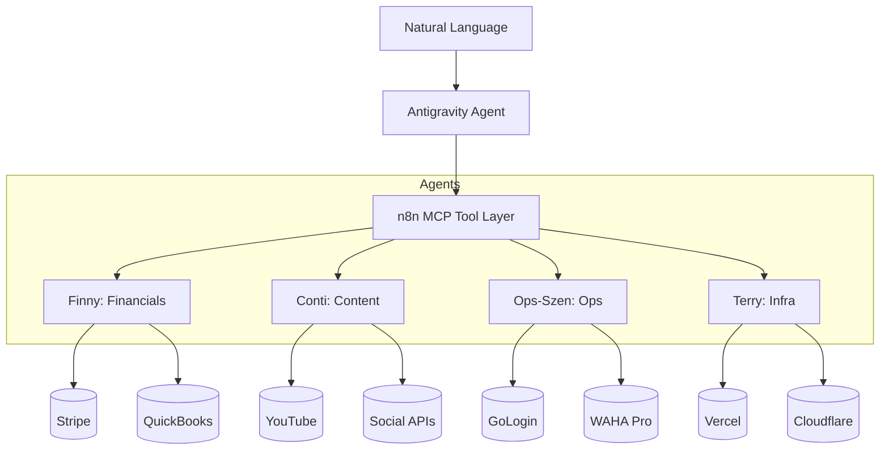

# Rensto Domain Agents: Technical Blueprint

This document details the technical implementation strategy for the specialized "Terry-like" agents. Each agent acts as a high-level MCP tool that orchestrates multiple n8n nodes and external APIs.

## 💹 Finny (The Profit Guardian)
**Core Engine**: n8n Workflow `FIN-PROFIT-001`
- **Integrations**:
  - **Stripe**: Uses the `Stripe API` (via n8n node) to monitor subscription renewals and churn events.
  - **QuickBooks**: Uses `Intuit OAuth2` to pull P&L data and reconcile invoices with Firestore.
  - **Firestore**: Primary source for customer metadata (found in `customers` collection).
- **MCP Tool Definition**: `get_financial_health(customerId)`, `generate_revenue_report(period)`.

## 🎬 Conti (The Growth Engine)
**Core Engine**: n8n Workflow `CON-GROW-001` (modernized from `Tax4Us Podcast Master`)
- **Integrations**:
  - **Apify**: Triggers `youtube-transcripts` actor to extract raw data.
  - **YouTube API**: Fetches channel analytics and initiates uploads.
  - **Social APIs**: FB/IG/TikTok (via WAHA or direct Graph API) for snippet distribution.
  - **OpenAI/Anthropic**: Processes transcripts into viral hooks and summaries.
- **MCP Tool Definition**: `summarize_podcast(episodeId)`, `distribute_content_to_socials(mediaUrl)`.

## ⚙️ Ops-Szen (The Specialized Manager)
**Core Engine**: n8n Workflow `OPS-SZEN-001`
- **Integrations**:
  - **GoLogin API**: Orchestrates browser profile rotation for scraping stability.
  - **WAHA Pro**: Manages WhatsApp routing for UAD specific lead flows.
  - **Scraping Scripts**: Encapsulates `massive-facebook-scraping.js` into an n8n executable node.
- **MCP Tool Definition**: `check_profile_health()`, `initiate_scraping_run(niche)`.

## 🌩️ Tech-Terry v2 (The Infra Agent)
**Core Engine**: n8n Workflow `INT-INFRA-002`
- **Integrations**:
  - **Vercel API**: Monitors deployment status and logs.
  - **Cloudflare API**: Manages DNS and Cache settings.
  - **Racknerd SSH**: Executes the existing health check scripts.
- **MCP Tool Definition**: `monitor_server_load()`, `deploy_hotfix()`.

---

## Technical Flow

