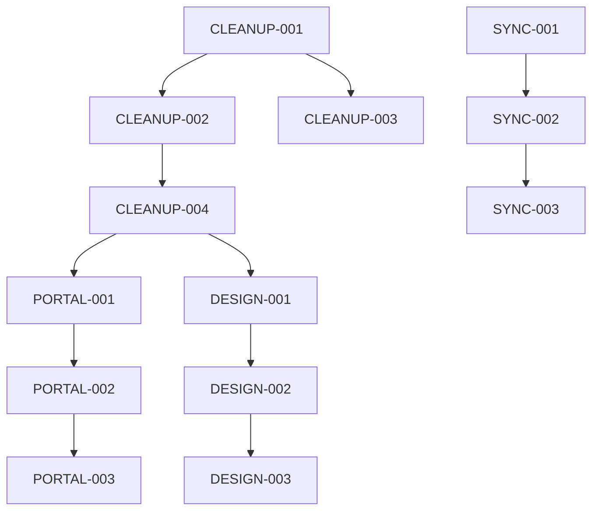

# 📝 **Sarah (Scrum Master) - Cleanup User Stories**

## 🎯 **User Stories & Sprint Planning**

**Project**: Comprehensive System Cleanup and Update  
**Scrum Master**: Sarah  
**Date**: 2025-01-21  
**BMAD Method**: v4.33.1  
**Input**: Winston's Architecture  

## 📋 **Sprint Planning**

### **Sprint Overview**
```javascript
{
  "sprintDuration": "4 days",
  "sprintGoal": "Complete systematic cleanup and organization of Rensto codebase",
  "teamCapacity": "Full-time focus on cleanup tasks",
  "definitionOfDone": "All stories completed, tested, and documented"
}
```

## 🧹 **Epic 1: Old BMAD References Cleanup**

### **Story 1.1: Archive Old BMAD Documentation**
```javascript
{
  "storyId": "CLEANUP-001",
  "title": "Archive Old BMAD Documentation Files",
  "as": "a developer",
  "iWant": "to archive old BMAD documentation files",
  "soThat": "i can maintain a clean codebase without losing historical information",
  "acceptanceCriteria": [
    "Archive archived/data/md-review-2025-08-19/ directory to archived/old-bmad-references/",
    "Move all old BMAD documentation files to organized archive structure",
    "Update any references to point to new documentation",
    "Verify no broken links remain in active documentation",
    "Create archive index for future reference"
  ],
  "storyPoints": 3,
  "priority": "High",
  "dependencies": [],
  "definitionOfDone": [
    "All old BMAD files moved to archive",
    "No broken references in active codebase",
    "Archive structure documented",
    "Tested to ensure no functionality broken"
  ]
}
```

### **Story 1.2: Update Execution Scripts to BMAD v4.33.1**
```javascript
{
  "storyId": "CLEANUP-002",
  "title": "Update All Execution Scripts to Use New BMAD Method",
  "as": "a developer",
  "iWant": "to update all execution scripts to use new BMAD method v4.33.1",
  "soThat": "i can ensure consistency across all automation processes",
  "acceptanceCriteria": [
    "Update execute_optimization.py to use BMAD v4.33.1 workflow",
    "Update execute_vps_optimization.py to use BMAD v4.33.1 workflow",
    "Update execute_scripts_cleanup.py to use BMAD v4.33.1 workflow",
    "Update execute_security_optimization.py to use BMAD v4.33.1 workflow",
    "Test all scripts to ensure they work correctly with new method",
    "Update script documentation to reflect new BMAD method"
  ],
  "storyPoints": 5,
  "priority": "High",
  "dependencies": ["CLEANUP-001"],
  "definitionOfDone": [
    "All execution scripts updated",
    "All scripts tested and working",
    "Documentation updated",
    "No errors in script execution"
  ]
}
```

### **Story 1.3: Archive Redundant BMAD Scripts**
```javascript
{
  "storyId": "CLEANUP-003",
  "title": "Archive Redundant BMAD Scripts",
  "as": "a developer",
  "iWant": "to archive redundant BMAD scripts",
  "soThat": "i can eliminate confusion and maintain clean codebase",
  "acceptanceCriteria": [
    "Archive scripts/bmad-method-implementation.js to archived/old-scripts/",
    "Archive scripts/rensto-integration-summary.md to archived/old-docs/",
    "Update any references to these files in active codebase",
    "Verify no dependencies are broken by archiving",
    "Create documentation of archived files for future reference"
  ],
  "storyPoints": 2,
  "priority": "Medium",
  "dependencies": ["CLEANUP-001"],
  "definitionOfDone": [
    "Redundant scripts archived",
    "No broken dependencies",
    "Archive documented",
    "Tested to ensure no functionality broken"
  ]
}
```

### **Story 1.4: Update Documentation References**
```javascript
{
  "storyId": "CLEANUP-004",
  "title": "Update All Documentation to Reference New BMAD Method",
  "as": "a developer",
  "iWant": "to update all documentation to reference new BMAD method",
  "soThat": "i can ensure consistency in all documentation",
  "acceptanceCriteria": [
    "Update README.md with new BMAD workflow v4.33.1",
    "Update ops/plan.md with new BMAD method references",
    "Update ops/checklist.md with new BMAD references",
    "Update any other documentation files with BMAD references",
    "Verify all documentation is consistent and accurate",
    "Test all documentation links to ensure they work"
  ],
  "storyPoints": 3,
  "priority": "High",
  "dependencies": ["CLEANUP-002"],
  "definitionOfDone": [
    "All documentation updated",
    "All links working",
    "Documentation consistent",
    "Reviewed for accuracy"
  ]
}
```

## 🔄 **Epic 2: GitHub Synchronization**

### **Story 2.1: Push Current Changes to GitHub**
```javascript
{
  "storyId": "SYNC-001",
  "title": "Push All Current Changes to GitHub",
  "as": "a developer",
  "iWant": "to push all current changes to GitHub",
  "soThat": "i can ensure all work is backed up and synchronized",
  "acceptanceCriteria": [
    "Push all local commits to origin/main",
    "Verify all changes are properly synchronized",
    "Check that no conflicts exist between local and remote",
    "Confirm working tree is clean after push",
    "Verify all files are properly tracked in git"
  ],
  "storyPoints": 1,
  "priority": "High",
  "dependencies": [],
  "definitionOfDone": [
    "All changes pushed to GitHub",
    "No conflicts or errors",
    "Working tree clean",
    "All files properly tracked"
  ]
}
```

### **Story 2.2: Set Up Branch Protection for Main Branch**
```javascript
{
  "storyId": "SYNC-002",
  "title": "Set Up Branch Protection for Main Branch",
  "as": "a developer",
  "iWant": "to set up branch protection for main branch",
  "soThat": "i can prevent accidental changes and ensure code quality",
  "acceptanceCriteria": [
    "Enable branch protection on main branch",
    "Require pull request reviews before merging",
    "Require status checks to pass before merging",
    "Prevent force pushes to main branch",
    "Require linear history on main branch",
    "Test branch protection rules work correctly"
  ],
  "storyPoints": 2,
  "priority": "Medium",
  "dependencies": ["SYNC-001"],
  "definitionOfDone": [
    "Branch protection enabled",
    "All rules configured",
    "Rules tested and working",
    "Documentation updated"
  ]
}
```

### **Story 2.3: Create Auto-Sync Workflow**
```javascript
{
  "storyId": "SYNC-003",
  "title": "Create Automated Sync Workflow",
  "as": "a developer",
  "iWant": "to create automated sync workflow",
  "soThat": "i can ensure real-time updates without manual intervention",
  "acceptanceCriteria": [
    "Create .github/workflows/auto-sync.yml",
    "Configure automatic push on successful tests",
    "Set up notifications for sync status",
    "Configure workflow to run on develop branch pushes",
    "Test workflow functionality end-to-end",
    "Document workflow configuration and usage"
  ],
  "storyPoints": 3,
  "priority": "Medium",
  "dependencies": ["SYNC-002"],
  "definitionOfDone": [
    "Workflow created and configured",
    "Workflow tested and working",
    "Notifications set up",
    "Documentation complete"
  ]
}
```

## 🎯 **Epic 3: Portal Architecture Planning**

### **Story 3.1: Create Customer Portal Architecture Document**
```javascript
{
  "storyId": "PORTAL-001",
  "title": "Create Customer Portal Architecture Document",
  "as": "a product manager",
  "iWant": "to create comprehensive customer portal architecture document",
  "soThat": "i can guide development of customer-specific features",
  "acceptanceCriteria": [
    "Define customer portal structure and features",
    "Specify authentication system (magic link)",
    "Define URL structure for customer portals",
    "Document customer-specific feature requirements",
    "Create technical architecture diagrams",
    "Define API endpoints for customer portal",
    "Document multi-tenant architecture approach"
  ],
  "storyPoints": 5,
  "priority": "High",
  "dependencies": ["CLEANUP-004"],
  "definitionOfDone": [
    "Architecture document complete",
    "All diagrams created",
    "API endpoints defined",
    "Document reviewed and approved"
  ]
}
```

### **Story 3.2: Create Admin Portal Architecture Document**
```javascript
{
  "storyId": "PORTAL-002",
  "title": "Create Admin Portal Architecture Document",
  "as": "a product manager",
  "iWant": "to create comprehensive admin portal architecture document",
  "soThat": "i can guide development of admin management features",
  "acceptanceCriteria": [
    "Define admin portal structure and features",
    "Specify customer management capabilities",
    "Define system monitoring features",
    "Document business intelligence requirements",
    "Create technical architecture diagrams",
    "Define API endpoints for admin portal",
    "Document security and access control requirements"
  ],
  "storyPoints": 5,
  "priority": "High",
  "dependencies": ["PORTAL-001"],
  "definitionOfDone": [
    "Architecture document complete",
    "All diagrams created",
    "API endpoints defined",
    "Security requirements documented",
    "Document reviewed and approved"
  ]
}
```

### **Story 3.3: Create Authentication System Design Document**
```javascript
{
  "storyId": "PORTAL-003",
  "title": "Create Authentication System Design Document",
  "as": "a product manager",
  "iWant": "to create authentication system design document",
  "soThat": "i can ensure secure and user-friendly access",
  "acceptanceCriteria": [
    "Define magic link authentication flow",
    "Specify security requirements and rate limiting",
    "Define session management strategy",
    "Document multi-tenant authentication approach",
    "Create authentication flow diagrams",
    "Define JWT token structure and management",
    "Document security best practices and compliance"
  ],
  "storyPoints": 4,
  "priority": "High",
  "dependencies": ["PORTAL-002"],
  "definitionOfDone": [
    "Authentication design complete",
    "Flow diagrams created",
    "Security requirements defined",
    "Document reviewed and approved"
  ]
}
```

## 🎨 **Epic 4: Design System Consolidation**

### **Story 4.1: Archive Old Design System Files**
```javascript
{
  "storyId": "DESIGN-001",
  "title": "Archive Old Design System Files",
  "as": "a developer",
  "iWant": "to archive old design system files",
  "soThat": "i can maintain clean design system without losing historical work",
  "acceptanceCriteria": [
    "Archive apps/web/design-gallery.html to archived/old-design/",
    "Archive apps/web/rensto-gallery.html to archived/old-design/",
    "Update any references to these files in active codebase",
    "Verify no broken links remain",
    "Create archive index for design files",
    "Document why files were archived"
  ],
  "storyPoints": 2,
  "priority": "Medium",
  "dependencies": ["CLEANUP-004"],
  "definitionOfDone": [
    "Old design files archived",
    "No broken references",
    "Archive documented",
    "Tested to ensure no functionality broken"
  ]
}
```

### **Story 4.2: Consolidate Design System Components**
```javascript
{
  "storyId": "DESIGN-002",
  "title": "Consolidate Design System Components",
  "as": "a developer",
  "iWant": "to consolidate design system components",
  "soThat": "i can ensure consistency across all UI components",
  "acceptanceCriteria": [
    "Update apps/web/rensto-site/src/lib/design-system.ts",
    "Integrate GSAP animations properly",
    "Ensure shadcn/ui components are styled consistently",
    "Verify all brand colors and typography are applied",
    "Create component documentation",
    "Test all components for consistency",
    "Update component usage examples"
  ],
  "storyPoints": 4,
  "priority": "High",
  "dependencies": ["DESIGN-001"],
  "definitionOfDone": [
    "Design system consolidated",
    "All components styled consistently",
    "GSAP integrated properly",
    "Documentation complete",
    "Components tested"
  ]
}
```

### **Story 4.3: Test GSAP Integration**
```javascript
{
  "storyId": "DESIGN-003",
  "title": "Test GSAP Integration",
  "as": "a developer",
  "iWant": "to test GSAP integration",
  "soThat": "i can ensure animations work properly across the system",
  "acceptanceCriteria": [
    "Test GSAP MCP server functionality",
    "Verify animations work in customer portal",
    "Verify animations work in admin portal",
    "Test performance and accessibility of animations",
    "Test animations on different devices and browsers",
    "Document animation usage patterns",
    "Create animation performance guidelines"
  ],
  "storyPoints": 3,
  "priority": "Medium",
  "dependencies": ["DESIGN-002"],
  "definitionOfDone": [
    "GSAP integration tested",
    "Animations working across all portals",
    "Performance guidelines created",
    "Documentation complete"
  ]
}
```

## 📊 **Sprint Backlog**

### **Day 1: Cleanup Execution**
```javascript
{
  "day1": [
    "CLEANUP-001: Archive Old BMAD Documentation (3 points)",
    "CLEANUP-003: Archive Redundant BMAD Scripts (2 points)",
    "SYNC-001: Push Current Changes to GitHub (1 point)"
  ],
  "totalPoints": 6,
  "priority": "High"
}
```

### **Day 2: Script Updates & Sync**
```javascript
{
  "day2": [
    "CLEANUP-002: Update Execution Scripts to BMAD v4.33.1 (5 points)",
    "CLEANUP-004: Update Documentation References (3 points)",
    "SYNC-002: Set Up Branch Protection (2 points)"
  ],
  "totalPoints": 10,
  "priority": "High"
}
```

### **Day 3: Portal Planning**
```javascript
{
  "day3": [
    "PORTAL-001: Create Customer Portal Architecture (5 points)",
    "PORTAL-002: Create Admin Portal Architecture (5 points)",
    "PORTAL-003: Create Authentication System Design (4 points)"
  ],
  "totalPoints": 14,
  "priority": "High"
}
```

### **Day 4: Design System & Testing**
```javascript
{
  "day4": [
    "DESIGN-001: Archive Old Design System Files (2 points)",
    "DESIGN-002: Consolidate Design System Components (4 points)",
    "DESIGN-003: Test GSAP Integration (3 points)",
    "SYNC-003: Create Auto-Sync Workflow (3 points)"
  ],
  "totalPoints": 12,
  "priority": "Medium"
}
```

## 📈 **Sprint Metrics**

### **Story Point Distribution**
```javascript
{
  "totalStories": 12,
  "totalPoints": 42,
  "averagePointsPerDay": 10.5,
  "storyDistribution": {
    "cleanup": "13 points (31%)",
    "sync": "6 points (14%)",
    "portal": "14 points (33%)",
    "design": "9 points (22%)"
  }
}
```

### **Dependencies Map**


## 🎯 **Definition of Done**

### **Story Level DoD**
- [ ] All acceptance criteria met
- [ ] Code reviewed and approved
- [ ] Tests written and passing
- [ ] Documentation updated
- [ ] No breaking changes introduced

### **Sprint Level DoD**
- [ ] All stories completed
- [ ] All tests passing
- [ ] All documentation updated
- [ ] Code deployed and tested
- [ ] Sprint review completed
- [ ] Retrospective completed

---

**This comprehensive user story breakdown ensures systematic execution of all cleanup and improvement tasks with clear acceptance criteria and proper sprint planning.** 🚀
