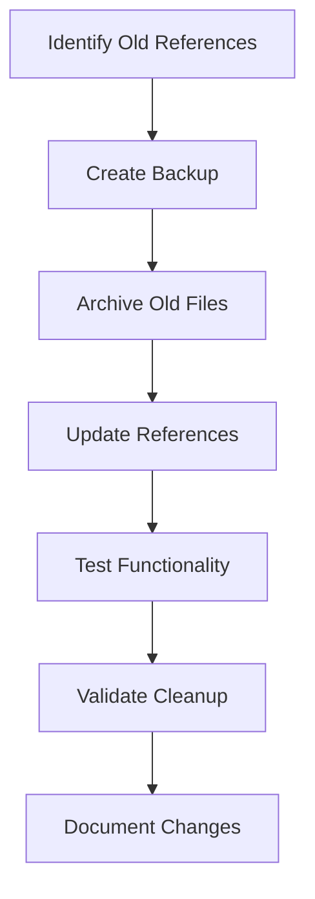
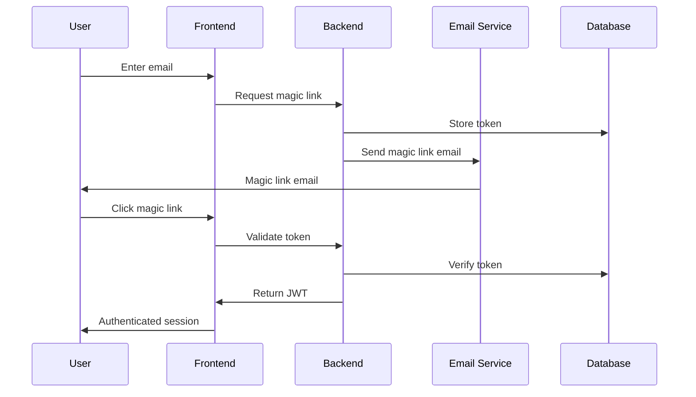

# 🏗️ **Winston (Architect) - Cleanup Architecture**

## 🎯 **System Architecture Design**

**Project**: Comprehensive System Cleanup and Update  
**Architect**: Winston  
**Date**: 2025-01-21  
**BMAD Method**: v4.33.1  
**Input**: John's PRD  

## 📊 **Architecture Overview**

### **System Architecture Principles**
```javascript
{
  "principles": [
    "Zero-Dupes Architecture - No duplicate data or functionality",
    "Clean Codebase - Organized, documented, maintainable",
    "BMAD Method v4.33.1 - Systematic approach to all changes",
    "Modular Design - Independent, testable components",
    "Security First - Secure authentication and data handling",
    "Scalability - Support for multiple customers and growth"
  ]
}
```

## 🧹 **Epic 1: Cleanup System Architecture**

### **1.1 File Organization Architecture**

#### **Current File Structure**
```bash
rensto/
├── archived/                    # Historical files
│   ├── data/
│   │   └── md-review-2025-08-19/  # ❌ Old BMAD references
│   ├── scripts/                 # ❌ Old scripts
│   └── docs/                    # ❌ Old documentation
├── scripts/                     # Active scripts
│   ├── bmad-method-implementation.js  # ❌ Redundant
│   └── rensto-integration-summary.md  # ❌ Redundant
├── execute_*.py                 # ❌ Need BMAD v4.33.1 updates
├── docs/                        # Active documentation
├── apps/web/                    # Web application
└── config/                      # Configuration files
```

#### **Target File Structure**
```bash
rensto/
├── archived/                    # Historical files
│   ├── old-bmad-references/     # ✅ Organized old BMAD files
│   ├── old-scripts/             # ✅ Organized old scripts
│   └── old-docs/                # ✅ Organized old documentation
├── scripts/                     # Active scripts
│   └── [clean, active scripts only]
├── execute_*.py                 # ✅ Updated to BMAD v4.33.1
├── docs/                        # Active documentation
│   ├── bmad-implementation-plan.md
│   ├── cleanup-and-update-plan.md
│   ├── customer-portal-architecture.md
│   ├── admin-portal-architecture.md
│   └── design-system-guide.md
├── apps/web/                    # Web application
└── config/                      # Configuration files
```

### **1.2 Cleanup Process Architecture**

#### **Cleanup Workflow**


#### **Backup Strategy**
```javascript
{
  "backupStrategy": {
    "beforeCleanup": "Create timestamped backup of entire codebase",
    "archiving": "Move files to archived/ with clear organization",
    "validation": "Test all functionality after cleanup",
    "rollback": "Keep original files in archive for potential restoration"
  }
}
```

### **1.3 Documentation Architecture**

#### **Documentation Structure**
```javascript
{
  "documentationLayers": {
    "executive": "High-level overview and strategy",
    "technical": "Implementation details and architecture",
    "operational": "Day-to-day operations and maintenance",
    "reference": "Quick reference guides and APIs"
  },
  "documentationTypes": {
    "plans": "Strategic and tactical plans",
    "architectures": "System and component architectures",
    "guides": "How-to guides and tutorials",
    "references": "API documentation and specifications"
  }
}
```

## 🔄 **Epic 2: GitHub Synchronization Architecture**

### **2.1 Git Workflow Architecture**

#### **Branch Strategy**
```javascript
{
  "branchStrategy": {
    "main": "Production-ready code",
    "develop": "Integration branch for features",
    "feature/*": "Individual feature development",
    "hotfix/*": "Critical bug fixes"
  },
  "protectionRules": {
    "main": {
      "requireReviews": true,
      "requireStatusChecks": true,
      "preventForcePush": true,
      "requireLinearHistory": true
    }
  }
}
```

#### **CI/CD Pipeline Architecture**
```yaml
# .github/workflows/auto-sync.yml
name: Auto Sync
on:
  push:
    branches: [develop]
  pull_request:
    branches: [main]

jobs:
  test:
    runs-on: ubuntu-latest
    steps:
      - uses: actions/checkout@v3
      - name: Run tests
        run: npm test
      - name: Auto-sync to main
        if: success() && github.ref == 'refs/heads/develop'
        run: |
          git checkout main
          git merge develop
          git push origin main
```

### **2.2 Sync Monitoring Architecture**

#### **Sync Health Monitoring**
```javascript
{
  "monitoring": {
    "syncStatus": "Real-time sync status tracking",
    "conflictDetection": "Automatic conflict detection",
    "notificationSystem": "Alerts for sync issues",
    "healthDashboard": "Visual sync health monitoring"
  }
}
```

## 🎯 **Epic 3: Portal Architecture**

### **3.1 Customer Portal Architecture**

#### **System Architecture**
```typescript
interface CustomerPortalArchitecture {
  // Frontend Layer
  frontend: {
    framework: 'Next.js 14',
    styling: 'Tailwind CSS + shadcn/ui',
    animations: 'GSAP',
    stateManagement: 'Zustand'
  },
  
  // Backend Layer
  backend: {
    api: 'Next.js API Routes',
    database: 'PostgreSQL (multi-tenant)',
    authentication: 'Magic Link + JWT',
    caching: 'Redis'
  },
  
  // Infrastructure Layer
  infrastructure: {
    hosting: 'Vercel',
    cdn: 'Cloudflare',
    monitoring: 'Rollbar',
    analytics: 'Custom analytics'
  }
}
```

#### **Multi-Tenant Architecture**
```javascript
{
  "multiTenantStrategy": {
    "database": "Schema-based isolation",
    "authentication": "Tenant-aware JWT tokens",
    "routing": "Subdomain-based routing",
    "customization": "Tenant-specific configurations"
  },
  "tenantIsolation": {
    "data": "Complete data isolation per tenant",
    "features": "Feature flags per tenant",
    "branding": "Custom branding per tenant",
    "security": "Tenant-specific security policies"
  }
}
```

#### **URL Routing Architecture**
```javascript
{
  "routingStrategy": {
    "production": {
      "main": "https://rensto.com",
      "admin": "https://admin.rensto.com",
      "customers": "https://[customer].rensto.com"
    },
    "development": {
      "main": "https://rensto-business-system.vercel.app",
      "admin": "https://rensto-business-system.vercel.app/admin",
      "customers": "https://rensto-business-system.vercel.app/portal/[slug]"
    }
  }
}
```

### **3.2 Admin Portal Architecture**

#### **Admin System Architecture**
```typescript
interface AdminPortalArchitecture {
  // Customer Management
  customerManagement: {
    crud: 'Full CRUD operations for customers',
    onboarding: 'Automated customer onboarding',
    analytics: 'Customer usage analytics',
    support: 'Customer support tools'
  },
  
  // System Monitoring
  systemMonitoring: {
    performance: 'Real-time performance monitoring',
    errors: 'Error tracking and alerting',
    usage: 'Resource utilization tracking',
    security: 'Security monitoring and alerts'
  },
  
  // Agent Management
  agentManagement: {
    deployment: 'n8n workflow deployment',
    monitoring: 'Agent performance tracking',
    configuration: 'Agent configuration management',
    troubleshooting: 'Agent debugging tools'
  },
  
  // Business Intelligence
  businessIntelligence: {
    revenue: 'Financial analytics and reporting',
    usage: 'Customer usage patterns',
    performance: 'System performance metrics',
    trends: 'Business trend analysis'
  }
}
```

### **3.3 Authentication Architecture**

#### **Magic Link Authentication Flow**


#### **Security Architecture**
```javascript
{
  "securityMeasures": {
    "authentication": {
      "magicLink": "Secure token generation and validation",
      "jwt": "Short-lived JWT tokens with refresh",
      "rateLimiting": "Rate limiting on authentication endpoints",
      "sessionManagement": "Secure session handling"
    },
    "authorization": {
      "rbac": "Role-based access control",
      "tenantIsolation": "Tenant-specific permissions",
      "apiSecurity": "API key authentication for services"
    },
    "dataProtection": {
      "encryption": "Data encryption at rest and in transit",
      "backup": "Secure backup and recovery",
      "audit": "Comprehensive audit logging"
    }
  }
}
```

## 🎨 **Epic 4: Design System Architecture**

### **4.1 Design System Architecture**

#### **Component Architecture**
```typescript
interface DesignSystemArchitecture {
  // Core Design Tokens
  designTokens: {
    colors: 'Rensto brand colors and variants',
    typography: 'Font families, sizes, and weights',
    spacing: 'Consistent spacing scale',
    shadows: 'Elevation and depth system'
  },
  
  // Component Library
  components: {
    base: 'shadcn/ui base components',
    custom: 'Rensto-specific custom components',
    animations: 'GSAP animation components',
    layouts: 'Layout and grid components'
  },
  
  // Integration Layer
  integration: {
    tailwind: 'Tailwind CSS integration',
    gsap: 'GSAP animation integration',
    shadcn: 'shadcn/ui component integration',
    theming: 'Multi-tenant theming system'
  }
}
```

#### **GSAP Integration Architecture**
```javascript
{
  "gsapIntegration": {
    "mcpServer": "GSAP MCP server for AI assistance",
    "animations": {
      "pageTransitions": "Smooth page transitions",
      "microInteractions": "Subtle UI feedback",
      "scrollAnimations": "Scroll-triggered animations",
      "loadingStates": "Loading and progress animations"
    },
    "performance": {
      "optimization": "Animation performance optimization",
      "accessibility": "Reduced motion support",
      "mobile": "Mobile-optimized animations"
    }
  }
}
```

### **4.2 Multi-Tenant Theming Architecture**

#### **Theme System**
```typescript
interface ThemeArchitecture {
  // Base Theme
  baseTheme: {
    colors: 'Default Rensto brand colors',
    typography: 'Default font system',
    spacing: 'Default spacing scale',
    components: 'Default component styles'
  },
  
  // Tenant Customization
  tenantCustomization: {
    colors: 'Tenant-specific color overrides',
    branding: 'Tenant logos and branding',
    features: 'Tenant-specific feature flags',
    layout: 'Tenant-specific layout options'
  },
  
  // Theme Application
  themeApplication: {
    cssVariables: 'CSS custom properties for theming',
    dynamicLoading: 'Dynamic theme loading',
    caching: 'Theme caching for performance',
    fallbacks: 'Fallback theme handling'
  }
}
```

## 🔧 **Implementation Architecture**

### **4.1 Development Workflow**
```javascript
{
  "developmentWorkflow": {
    "planning": "BMAD method v4.33.1 planning",
    "development": "Feature branch development",
    "testing": "Automated and manual testing",
    "deployment": "Automated deployment pipeline",
    "monitoring": "Real-time monitoring and alerting"
  }
}
```

### **4.2 Quality Assurance Architecture**
```javascript
{
  "qualityAssurance": {
    "automatedTesting": {
      "unit": "Component and function testing",
      "integration": "API and service testing",
      "e2e": "End-to-end user journey testing",
      "performance": "Performance and load testing"
    },
    "manualTesting": {
      "usability": "User experience testing",
      "accessibility": "Accessibility compliance testing",
      "security": "Security vulnerability testing",
      "compatibility": "Cross-browser and device testing"
    }
  }
}
```

## 📊 **Architecture Success Metrics**

### **Cleanup Architecture Metrics**
- **100%** of old files properly archived
- **0** broken references or links
- **100%** of documentation updated
- **Clean** and organized file structure

### **GitHub Architecture Metrics**
- **100%** of changes synchronized
- **Branch protection** properly configured
- **Auto-sync** workflow functioning
- **0** sync conflicts or issues

### **Portal Architecture Metrics**
- **Complete** portal architecture documented
- **Secure** authentication system designed
- **Scalable** multi-tenant architecture
- **Performance** optimized for all users

### **Design System Architecture Metrics**
- **Consolidated** design system
- **GSAP** properly integrated
- **Multi-tenant** theming working
- **Consistent** branding across all components

---

**This architecture design provides the technical foundation for systematic implementation of all cleanup and improvement tasks, ensuring scalability, security, and maintainability.** 🚀
