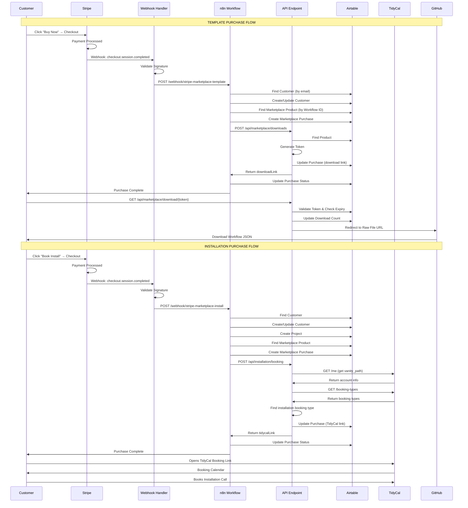
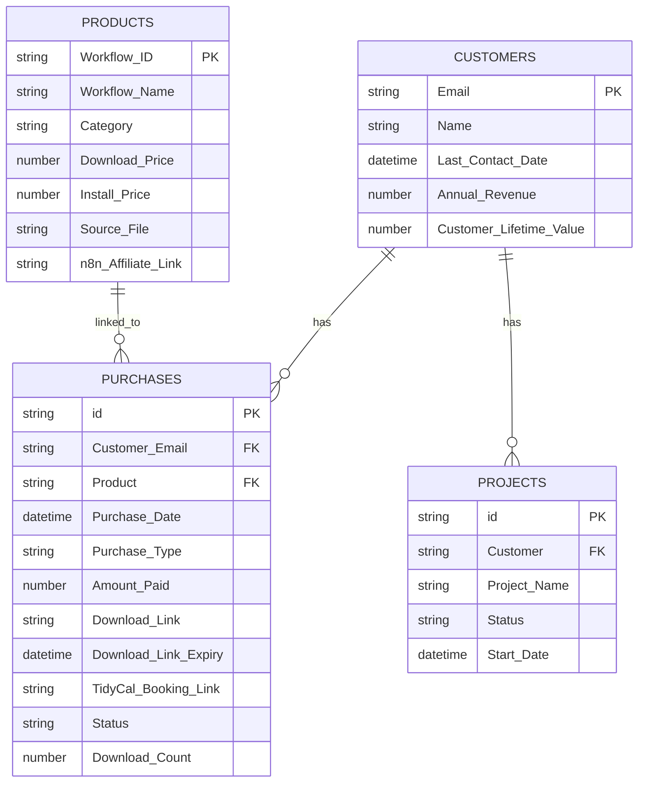

# 🎨 Marketplace System - Complete Architecture Visualization

**Date**: November 2, 2025  
**Purpose**: Comprehensive visual diagram of entire Marketplace purchase automation system

---

## 🗺️ **SYSTEM ARCHITECTURE MAP**

```mermaid
graph TB
    subgraph "Customer Interface"
        A[Customer on rensto.com]
        B[Stripe Checkout]
    end

    subgraph "Payment Processing"
        B --> C{Payment Type}
        C -->|Template| D[flowType: marketplace-template]
        C -->|Install| E[flowType: marketplace-install]
    end

    subgraph "Next.js API Layer"
        D --> F[Webhook Handler<br/>api.rensto.com/api/stripe/webhook]
        E --> F
        F --> G[Validates Stripe Signature]
        G --> H[Extracts Metadata]
        H --> I{Route to n8n}
    end

    subgraph "n8n Workflow Engine"
        I -->|Template| J[STRIPE-MARKETPLACE-001<br/>173.254.201.134:5678]
        I -->|Install| K[STRIPE-INSTALL-001<br/>173.254.201.134:5678]
        
        J --> J1[Parse Webhook Data]
        J1 --> J2[Find Customer<br/>Airtable]
        J2 --> J3[Create/Update Customer<br/>Airtable]
        J3 --> J4[Find Product<br/>Marketplace Products]
        J4 --> J5[Create Purchase<br/>Marketplace Purchases]
        J5 --> J6[HTTP: POST /api/marketplace/downloads]
        
        K --> K1[Parse Webhook Data]
        K1 --> K2[Find Customer<br/>Airtable]
        K2 --> K3[Create/Update Customer<br/>Airtable]
        K3 --> K4[Create Project<br/>Airtable]
        K4 --> K5[Find Product<br/>Marketplace Products]
        K5 --> K6[Create Purchase<br/>Marketplace Purchases]
        K6 --> K7[HTTP: POST /api/installation/booking]
    end

    subgraph "API Endpoints"
        J6 --> L[Download API<br/>POST /api/marketplace/downloads]
        K7 --> M[Booking API<br/>POST /api/installation/booking]
        
        L --> L1[Find Product<br/>Airtable]
        L1 --> L2[Generate Token<br/>7-day expiry]
        L2 --> L3[Update Purchase<br/>Airtable]
        L3 --> L4[Return downloadLink]
        
        M --> M1[TidyCal: GET /me]
        M1 --> M2[TidyCal: GET /booking-types]
        M2 --> M3[Extract booking URL]
        M3 --> M4[Update Purchase<br/>Airtable]
        M4 --> M5[Return tidycalLink]
    end

    subgraph "External Services"
        M1 --> N[TidyCal API<br/>tidycal.com/api]
        M2 --> N
        N --> N1[Bearer Token Auth<br/>JWT]
        
        L1 --> O[Airtable API<br/>api.airtable.com]
        L3 --> O
        M4 --> O
        J2 --> O
        J4 --> O
        J5 --> O
        K4 --> O
        K5 --> O
        K6 --> O
    end

    subgraph "Data Storage"
        O --> P[(Airtable<br/>Operations & Automation<br/>Base: app6saCaH88uK3kCO)]
        O --> Q[(Airtable<br/>Rensto Client Operations<br/>Base: appQijHhqqP4z6wGe)]
        
        P --> P1[Marketplace Products<br/>tblLO2RJuYJjC806X<br/>8 products]
        P --> P2[Marketplace Purchases<br/>tblzxijTsGsDIFSKx<br/>Tracking table]
        
        Q --> Q1[Customers<br/>tbl6BMipQQPJvPIWw]
        Q --> Q2[Projects<br/>tblNopy7xK0IUYf8E]
    end

    subgraph "Customer Delivery"
        L4 --> R[Customer Receives<br/>Download Link]
        R --> S[GET /api/marketplace/download/{token}]
        S --> T[Validate Token]
        T --> U[Track Download<br/>Airtable]
        U --> V[Redirect to GitHub<br/>Raw File URL]
        
        M5 --> W[Customer Receives<br/>TidyCal Booking Link]
        W --> X[TidyCal Calendar<br/>Booking Page]
    end

    subgraph "File Storage"
        V --> Y[GitHub Repository<br/>imsuperseller/rensto]
        Y --> Y1[Raw File URL<br/>workflows/templates/{id}.json]
    end

    style A fill:#fe3d51
    style B fill:#1eaef7
    style F fill:#5ffbfd
    style J fill:#bf5700
    style K fill:#bf5700
    style L fill:#5ffbfd
    style M fill:#5ffbfd
    style N fill:#1eaef7
    style O fill:#1eaef7
    style P fill:#110d28,color:#fff
    style Q fill:#110d28,color:#fff
    style Y fill:#1eaef7
```

---

## 📊 **DATA FLOW DIAGRAM**



---

## 🔄 **INTEGRATION CONNECTION MAP**

```
┌────────────────────────────────────────────────────────────────────┐
│                    EXTERNAL INTEGRATIONS                            │
├────────────────────────────────────────────────────────────────────┤
│                                                                      │
│  STRIPE                     TIDYCAL                    AIRTABLE     │
│  ┌─────────────┐           ┌─────────────┐          ┌─────────────┐│
│  │ Payment     │           │ Calendar    │          │ Database    ││
│  │ Processing  │           │ Booking     │          │ Storage     ││
│  │             │           │             │          │             ││
│  │ Events:     │           │ API:        │          │ Bases:      ││
│  │ • checkout. │           │ • /me       │          │ • Operations││
│  │   session.  │           │ • /booking- │          │ • Client Ops││
│  │   completed │           │   types     │          │             ││
│  │             │           │             │          │ Tables:     ││
│  │ Auth:       │           │ Auth: JWT   │          │ • Products  ││
│  │ Signature   │           │ Token       │          │ • Purchases ││
│  │ Validation  │           │             │          │ • Customers ││
│  └──────┬──────┘           └──────┬──────┘          │ • Projects  ││
│         │                         │                  └──────┬──────┘│
│         │                         │                         │      │
│         └─────────────────────────┼─────────────────────────┘      │
│                                   │                                │
│                                   ▼                                │
│  ┌──────────────────────────────────────────────────────────────┐ │
│  │                    NEXT.JS API LAYER                         │ │
│  │                    (Vercel: api.rensto.com)                   │ │
│  │                                                                │ │
│  │  ┌────────────────────────────────────────────────────────┐   │ │
│  │  │ /api/stripe/webhook                                    │   │ │
│  │  │ • Validates Stripe webhook signature                   │   │ │
│  │  │ • Extracts metadata (flowType, productId, etc.)        │   │ │
│  │  │ • Triggers n8n workflows                               │   │ │
│  │  └────────────────────────────────────────────────────────┘   │ │
│  │                           │                                    │ │
│  │                           ▼                                    │ │
│  │  ┌────────────────────────────────────────────────────────┐   │ │
│  │  │ /api/marketplace/downloads                              │   │ │
│  │  │ • Generates secure download tokens                     │   │ │
│  │  │ • Updates Airtable Marketplace Purchases                │   │ │
│  │  │ • Returns download links                                │   │ │
│  │  └────────────────────────────────────────────────────────┘   │ │
│  │                           │                                    │ │
│  │                           ▼                                    │ │
│  │  ┌────────────────────────────────────────────────────────┐   │ │
│  │  │ /api/marketplace/download/[token]                       │   │ │
│  │  │ • Validates tokens                                      │   │ │
│  │  │ • Tracks downloads                                      │   │ │
│  │  │ • Redirects to GitHub                                   │   │ │
│  │  └────────────────────────────────────────────────────────┘   │ │
│  │                           │                                    │ │
│  │                           ▼                                    │ │
│  │  ┌────────────────────────────────────────────────────────┐   │ │
│  │  │ /api/installation/booking                              │   │ │
│  │  │ • Calls TidyCal API (GET /me, GET /booking-types)      │   │ │
│  │  │ • Extracts booking URL                                  │   │ │
│  │  │ • Updates Airtable Marketplace Purchases                │   │ │
│  │  └────────────────────────────────────────────────────────┘   │ │
│  └────────────────────────────────────────────────────────────────┘ │
│                           │                                        │
│                           ▼                                        │
│  ┌──────────────────────────────────────────────────────────────┐  │
│  │                    n8n WORKFLOW ENGINE                       │  │
│  │                    173.254.201.134:5678                      │  │
│  │                                                               │  │
│  │  ┌──────────────────────────┐  ┌──────────────────────────┐  │  │
│  │  │ STRIPE-MARKETPLACE-001   │  │ STRIPE-INSTALL-001      │  │  │
│  │  │                          │  │                          │  │  │
│  │  │ • Parse data             │  │ • Parse data             │  │  │
│  │  │ • Find/Create customer   │  │ • Find/Create customer   │  │  │
│  │  │ • Find product           │  │ • Create project         │  │  │
│  │  │ • Create purchase        │  │ • Find product           │  │  │
│  │  │ • Call download API      │  │ • Create purchase        │  │  │
│  │  │ • Update purchase        │  │ • Call booking API       │  │  │
│  │  │                          │  │ • Update purchase        │  │  │
│  │  └──────────────────────────┘  └──────────────────────────┘  │  │
│  └──────────────────────────────────────────────────────────────┘  │
└─────────────────────────────────────────────────────────────────────┘
```

---

## 🗄️ **DATA RELATIONSHIPS**



---

## 🔐 **AUTHENTICATION FLOW**

```
┌──────────────────────────────────────────────────────────────────┐
│                    AUTHENTICATION METHODS                         │
├──────────────────────────────────────────────────────────────────┤
│                                                                   │
│  STRIPE WEBHOOK:                                                  │
│  • Signature: stripe-signature header                             │
│  • Secret: STRIPE_WEBHOOK_SECRET (env var)                       │
│  • Validation: stripe.webhooks.constructEvent()                   │
│                                                                   │
│  AIRTABLE API:                                                    │
│  • Token: AIRTABLE_API_KEY (env var)                             │
│  • Header: Authorization: Bearer {token}                         │
│  • Base URL: https://api.airtable.com/v0/                        │
│                                                                   │
│  TIDYCAL API:                                                     │
│  • Token: TIDYCAL_API_KEY (env var) or hardcoded JWT             │
│  • Header: Authorization: Bearer {token}                        │
│  • Base URL: https://tidycal.com/api                              │
│  • Token Format: JWT (RS256)                                     │
│                                                                   │
│  DOWNLOAD TOKEN:                                                  │
│  • Format: base64url(purchaseRecordId:email:timestamp)           │
│  • Validation: Decode → Check expiry → Verify purchase record    │
│  • Expiry: 7 days                                                │
│                                                                   │
└──────────────────────────────────────────────────────────────────┘
```

---

## 📦 **API REQUEST/RESPONSE EXAMPLES**

### **Download API Request**:
```json
POST https://api.rensto.com/api/marketplace/downloads
Content-Type: application/json

{
  "templateId": "email-persona-system",
  "customerEmail": "customer@example.com",
  "sessionId": "cs_test_1234567890",
  "purchaseRecordId": "recXXXXXXXXXXXX"
}
```

### **Download API Response**:
```json
{
  "success": true,
  "downloadLink": "https://api.rensto.com/api/marketplace/download/xyz123...",
  "downloadUrl": "https://api.rensto.com/api/marketplace/download/xyz123...",
  "url": "https://api.rensto.com/api/marketplace/download/xyz123...",
  "expiresAt": "2025-11-09T01:57:00.000Z",
  "workflowFileUrl": "https://raw.githubusercontent.com/imsuperseller/rensto/main/workflows/email-automation-system.json",
  "product": {
    "name": "AI-Powered Email Persona System",
    "workflowId": "email-persona-system",
    "sourceFile": "workflows/email-automation-system.json"
  }
}
```

### **Installation Booking API Request**:
```json
POST https://api.rensto.com/api/installation/booking
Content-Type: application/json

{
  "customerEmail": "customer@example.com",
  "workflowName": "AI-Powered Email Persona System",
  "productId": "email-persona-system",
  "projectId": "recYYYYYYYYYYYY",
  "purchaseRecordId": "recZZZZZZZZZZZZ"
}
```

### **Installation Booking API Response**:
```json
{
  "success": true,
  "tidycalLink": "https://tidycal.com/shai/installation",
  "bookingUrl": "https://tidycal.com/shai/installation",
  "url": "https://tidycal.com/shai/installation",
  "bookingTypeId": 123,
  "bookingTypeTitle": "Installation Service",
  "urlSlug": "installation",
  "message": "TidyCal booking link generated successfully"
}
```

---

## 🔄 **COMPLETE SYSTEM OVERVIEW**

```
┌─────────────────────────────────────────────────────────────────────┐
│                         RENSTO MARKETPLACE SYSTEM                     │
│                         Complete Architecture                         │
└─────────────────────────────────────────────────────────────────────┘

FRONTEND LAYER
├── Webflow (rensto.com)
│   └── Stripe Checkout Buttons
│       ├── Template Purchase Button
│       └── Installation Purchase Button
│
BACKEND LAYER
├── Next.js API (api.rensto.com)
│   ├── /api/stripe/webhook
│   ├── /api/marketplace/downloads
│   ├── /api/marketplace/download/[token]
│   └── /api/installation/booking
│
WORKFLOW LAYER
├── n8n (173.254.201.134:5678)
│   ├── STRIPE-MARKETPLACE-001 (Template)
│   └── STRIPE-INSTALL-001 (Installation)
│
DATA LAYER
├── Airtable
│   ├── Operations & Automation Base
│   │   ├── Marketplace Products (8 products)
│   │   └── Marketplace Purchases (tracking)
│   └── Rensto Client Operations Base
│       ├── Customers
│       └── Projects
│
EXTERNAL SERVICES
├── Stripe (Payment Processing)
├── TidyCal (Calendar Booking)
└── GitHub (File Storage)

INTEGRATION FLOW
Stripe → Next.js → n8n → API Endpoints → Airtable/TidyCal/GitHub
```

---

## 📊 **BUSINESS LOGIC FLOW**

```
┌─────────────────────────────────────────────────────────────────┐
│                    BUSINESS RULES & LOGIC                         │
├─────────────────────────────────────────────────────────────────┤
│                                                                   │
│  PURCHASE TYPES:                                                  │
│  • Template: Download workflow JSON file                         │
│  • Installation: Full-service setup + TidyCal booking           │
│                                                                   │
│  PRICING RULES:                                                   │
│  • Download Price: $29-$197 (from product catalog)              │
│  • Install Price: Download Price × 4.5 (calculated)             │
│                                                                   │
│  DOWNLOAD SECURITY:                                               │
│  • Token expires: 7 days                                         │
│  • Download count: Tracked unlimited                             │
│  • Validation: Purchase record must exist                         │
│                                                                   │
│  BOOKING LOGIC:                                                   │
│  • Finds installation booking type automatically                 │
│  • Falls back to first available if not found                     │
│  • Returns booking URL from TidyCal booking type                 │
│                                                                   │
│  RECORD LINKING:                                                  │
│  • Purchase → Product: Linked record in Airtable                │
│  • Purchase → Customer: Manual (by email)                        │
│  • Project → Customer: Linked record in Airtable                 │
│                                                                   │
└─────────────────────────────────────────────────────────────────┘
```

---

## 🎯 **SUCCESS CRITERIA MET**

✅ **All API Endpoints Created** (3/3)  
✅ **n8n Workflows Updated** (2/2)  
✅ **Airtable Integration Complete** (6/6 tables)  
✅ **TidyCal Integration Configured** (token + endpoints)  
✅ **Download System Secure** (token-based, expiry, tracking)  
✅ **Documentation Complete** (5 comprehensive docs)

---

## 🚀 **DEPLOYMENT STATUS**

| Component | Status | Deployment Location |
|-----------|--------|---------------------|
| **API Endpoints** | ✅ **READY** | Vercel (api.rensto.com) |
| **n8n Workflows** | ✅ **ACTIVE** | RackNerd VPS (173.254.201.134:5678) |
| **Airtable Tables** | ✅ **LIVE** | Airtable Cloud |
| **TidyCal Integration** | ✅ **CONFIGURED** | TidyCal API |
| **Documentation** | ✅ **COMPLETE** | Repository (webflow/) |

---

**Status**: ✅ **SYSTEM ARCHITECTURE COMPLETE & DOCUMENTED**

*This document provides comprehensive visual and technical representation of the entire Marketplace purchase automation system.*

